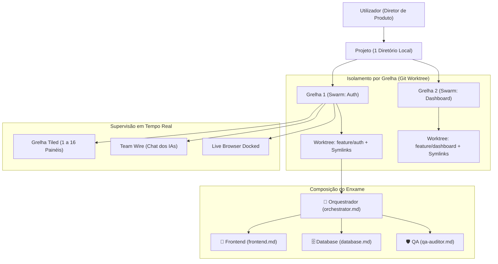

# 📄 Product Requirements Document (PRD): HelmADE
**The Zero-Cost Agent Development Environment (ADE) & Autonomous Swarm Cockpit**
*Versão 1.0 — Especificação Funcional Completa*

---

## 1. Visão Geral e Filosofia do Produto

### 1.1. O Que É o HelmADE
O **HelmADE** é uma aplicação desktop nativa concebida para atuar como o **Centro de Comando (Cockpit)** para o desenvolvimento de software através de **enxames (*swarms*) de agentes de inteligência artificial autónomos**.

O produto inverte o paradigma dos IDEs convencionais:
* **No modelo tradicional:** O utilizador passa horas a digitar sintaxe, a alternar entre ficheiros e a gerir terminais manualmente.
* **No modelo HelmADE:** O utilizador atua como **Arquiteto de Sistemas e Diretor de Produto**, expressando objetivos e requisitos em linguagem natural (por texto ou por voz). A aplicação gere, isola e supervisiona uma equipa de agentes de IA especializados que planeiam, programam, testam e depuram o software em paralelo diante dos seus olhos.

### 1.2. Os Três Invariantes Sagrados do HelmADE
1. **Custo Absoluto ZERO (0.00€ para construir e 0.00€ para usar):**
   - Não depende de nenhuma infraestrutura na cloud paga.
   - Não exige subscrições mensais a plataformas proprietárias.
   - Toda a orquestração, base de dados, terminais, isolamento de código e reconhecimento de voz funcionam localmente no computador do utilizador.
2. **Orquestração Multi-Agente Baseada em Ficheiros Markdown (`.md`):**
   - A inteligência e os papéis dos agentes são definidos em ficheiros `.md` abertos e versionáveis (prompts de sistema, permissões e competências), aproveitando a rede de agentes Antigravity já existente no sistema do utilizador.
3. **Concorrência Segura sem Corrupção de Código:**
   - Múltiplos agentes podem trabalhar no mesmo projeto em simultâneo sem nunca sobrescreverem ficheiros uns dos outros nem corromperem o histórico de versões.

---

## 2. Modelo de Domínio e Conceitos Centrais

### 2.1. O Conceito de Projeto
* Um **Projeto** corresponde estritamente a um único diretório de código no disco do utilizador (ex.: `/Users/simaosousa/meu-saas`).
* Não existe mistura de repositórios: cada janela do HelmADE está focada exclusivamente num único projeto.
* Todas as preferências, histórico de sessões, métricas de consumo e predefinições de equipa ficam gravadas localmente indexadas a esse projeto.

### 2.2. O Conceito de Grelha (*Grid*) / Swarm Independente
* Dentro do mesmo projeto, o utilizador pode abrir **múltiplas grelhas de trabalho em paralelo**, organizadas por abas no topo da janela.
* Cada grelha representa uma missão de negócio independente (ex.: Aba 1: *"Feature Autenticação"*; Aba 2: *"Redesign Dashboard"*; Aba 3: *"Otimização de Queries"*).
* Cada grelha tem a sua própria equipa de agentes, os seus próprios terminais, o seu próprio feed de comunicação e o seu próprio ambiente isolado.

### 2.3. O Conceito de Agente (Personas `.md`)
* Os agentes não são caixas pretas inalteráveis. Cada agente é configurado através de um ficheiro Markdown (`.md`) que descreve a sua persona, os seus objetivos, as ferramentas disponíveis e as suas regras invioláveis.
* Existe uma hierarquia funcional clara:
  - **O Orquestrador (`orchestrator.md`):** É o líder técnico. Recebe as instruções de alto nível do utilizador, cria planos de arquitetura, decompõe tarefas e despacha sub-tarefas para os agentes especialistas.
  - **Os Agentes Especialistas (`frontend.md`, `database.md`, `qa.md`, etc.):** Executam as tarefas técnicas delegadas, correm testes e reportam resultados de volta ao Orquestrador.

---

## 3. Requisitos Funcionais: O Que a Plataforma Deve Fazer

---

### MÓDULO 1: Gestão de Projetos e Workspaces
* **R1.1 — Seleção Rápida de Diretório:** A aplicação deve permitir abrir qualquer pasta local ou repositório Git através de um diálogo nativo do sistema ou arrastando a pasta para a janela.
* **R1.2 — Memória de Projetos Recentes:** A aplicação deve manter um ecrã inicial com a lista dos projetos abertos recentemente, caminho no disco, data da última alteração e estatísticas rápidas.
* **R1.3 — Persistência Local Imediata:** Todo o estado do projeto (grelhas abertas, histórico de comandos, agentes configurados) deve ser guardado localmente de forma automática e contínua, sem necessidade de ações manuais de "Guardar".

---

### MÓDULO 2: Sistema de Múltiplas Grelhas & Isolamento sem Conflitos
* **R2.1 — Abas de Grelhas Paralelas:** O utilizador deve poder criar novas grelhas de trabalho dentro do mesmo projeto com um clique ou atalho de teclado (`Cmd+T`), atribuindo um nome ou objetivo a cada aba.
* **R2.2 — Isolamento Automático via Git Worktrees:** 
  - Ao criar uma nova grelha, o sistema deve criar automaticamente um **Git Worktree** associado a uma branch de trabalho isolada (ex.: `helm/swarm-auth`).
  - Todos os terminais daquela grelha devem iniciar o seu diretório de execução (`cwd`) dentro dessa pasta isolada.
  - O código do projeto principal (`main`) nunca deve ser modificado diretamente por uma grelha enquanto os trabalhos estiverem em curso.
* **R2.3 — Gestão Automática de Dependências (Zero Desperdício de Disco):**
  - O sistema deve criar automaticamente links simbólicos (*symlinks*) para as pastas de dependências ignoradas no Git (como `node_modules/`, `.venv/` ou caches de build) entre o projeto principal e o worktree.
  - Isto garante que os agentes podem executar testes e compilar código de imediato na nova grelha sem necessidade de transferir gigabytes de bibliotecas nem duplicar espaço de armazenamento.
* **R2.4 — Alocação Dinâmica de Portas de Servidores:**
  - O sistema deve injetar variáveis de ambiente com portas de rede não colidentes em cada grelha (ex.: `PORT=3001` na Grelha 1, `PORT=3002` na Grelha 2), impedindo erros de porta ocupada (`EADDRINUSE`) caso múltiplas grelhas executem servidores locais em simultâneo.
* **R2.5 — Revisão e Fusão (*Merge*) Segura:**
  - Quando uma grelha termina a sua missão, a aplicação deve apresentar uma interface de revisão onde o utilizador visualiza o diff completo de ficheiros alterados.
  - A aplicação deve permitir fundir (*merge/squash*) a branch da grelha na branch principal com um clique.
  - Caso surjam conflitos de merge entre grelhas diferentes, a aplicação deve oferecer a opção de acionar o **Orquestrador** para resolver automaticamente os conflitos de código antes da fusão.

---

### MÓDULO 3: Grelha Tiled e Multiplexador de Terminais
* **R3.1 — Suporte de 1 a 16 Sessões Simultâneas:** O sistema deve suportar a renderização e execução concorrente de 1 até 16 painéis de terminal na mesma janela sem perda de desempenho ou lentidão.
* **R3.2 — Predefinições de Layout Rápidas:** A interface deve disponibilizar botões de layout com 1 clique para as configurações:
  - `1x1` (Vista Focada / Ecrã Inteiro)
  - `1x2` ou `2x1` (Divisão Horizontal ou Vertical)
  - `2x2` (Quatro Painéis — Layout Base)
  - `2x3` (Seis Painéis — Layout Recomendado para Enxames Full-Stack)
  - `3x3` (Nove Painéis) e `4x4` (Dezasseis Painéis)
* **R3.3 — Zoom / Maximizar Painel com 1 Toque:** O utilizador deve poder premir um atalho (ex.: `Cmd+Enter`) ou clicar duas vezes no cabeçalho de qualquer painel para expandi-lo a 100% do ecrã e regressar à grelha com a mesma facilidade.
* **R3.4 — Identificação Visual Personalizável:** Cada painel deve ter uma barra superior com:
  - Título editável (ex.: *"Orquestrador"*, *"Frontend React"*, *"Dev Server"*, *"Testes"*).
  - Ícone representativo do papel.
  - Distintivo de cor semântica (Dourado, Azul, Verde, Roxo, Vermelho, etc.).
  - Indicador de estado de atividade (A processar, Concluído, À espera de input, Erro).
* **R3.5 — Emulação Completa de Terminal:** Cada painel deve suportar emulação completa de terminal (cores ANSI de 24 bits, cursores, ferramentas de linha de comando interativas, spinners e programas ncurses).
* **R3.6 — Scrollback Persistente em Memória:** O histórico de saída de cada terminal deve permanecer guardado em memória circular local, de modo a que alternar entre layouts ou abas nunca limpe nem perca os logs anteriores.

---

### MÓDULO 4: Integração Nativa de Agentes Antigravity (`.md`)
* **R4.1 — Descoberta e Mapeamento de Ficheiros `.md`:** A aplicação deve ler automaticamente os ficheiros `.md` de personas de agentes presentes no sistema do utilizador (regras, prompts de sistema, ferramentas atribuídas).
* **R4.2 — Modelos de Enxame com 1 Clique (*Swarm Presets*):** A aplicação deve permitir lançar equipas inteiras pré-configuradas com um único clique.
  - *Exemplo de Preset "Full-Stack Team (6 Painéis)":*
    * Painel 1: `Orchestrator` (`orchestrator.md`)
    * Painel 2: `Frontend Specialist` (`frontend-design-specialist.md`)
    * Painel 3: `Fullstack Engineer` (`fullstack-engineer.md`)
    * Painel 4: `Database Specialist` (`database-specialist.md`)
    * Painel 5: `QA & Security Auditor` (`qa-security-auditor.md`)
    * Painel 6: Terminal da Shell do Sistema para o servidor local (`npm run dev`).
* **R4.3 — Injeção de Contexto Automática:** Ao arrancar um terminal com um agente, a aplicação deve injetar de forma transparente o prompt de sistema do ficheiro `.md` respetivo, as variáveis de ambiente necessárias e o diretório de trabalho correto.
* **R4.4 — Seleção de Modelo de IA por Agente & Perfis Cognitivos:**
  - A aplicação deve permitir ao utilizador escolher e configurar o modelo de IA específico para cada agente da equipa (no configurador de presets e no cabeçalho de cada painel).
  - Suporte a categorização por perfil cognitivo:
    * **Raciocínio Profundo / Extended Thinking** (ex.: Claude 3.7 Sonnet / o3-mini) para o Orquestrador, Arquitetura e QA Auditor.
    * **Pesquisa & Contexto Longo** (ex.: Gemini 2.5 Pro / Flash) para exploração de especificações e documentação.
    * **Velocidade & Economia** (ex.: Haiku / GPT-4o-mini) para tarefas rotineiras de frontend e refactors simples.
    * **Local & Offline (0.00€)** (ex.: Ollama / llama3 / deepseek-r1 locais) preservando o invariante de custo zero e privacidade total.
  - A seleção de modelo deve persistir localmente e injetar as flags/variáveis de ambiente correspondentes (ex.: `--model <id>`) no comando de arranque do agente no PTY.

---

### MÓDULO 5: Comunicação Inter-Agentes & "Team Wire"
* **R5.1 — Protocolo de Troca de Mensagens:** Os agentes devem poder comunicar diretamente entre si de forma estruturada (o Orquestrador envia tarefas e especificações; os especialistas devolvem relatórios de execução, erros e confirmações).
* **R5.2 — Espelhamento de Mensagens nos Terminais:**
  - Quando o Agente A envia uma mensagem para o Agente B, o terminal de A deve imprimir a mensagem de saída com identificador claro (`➔ [NOME-DO-AGENTE-B]: ...`).
  - O terminal do Agente B deve imediatamente imprimir a mensagem recebida (`🠔 [NOME-DO-AGENTE-A]: ...`).
* **R5.3 — Painel Lateral "Team Wire" (Feed de Diálogo da Equipa de IA):**
  - Cada grelha deve conter um painel de chat dedicado que exibe o histórico cronológico de todas as mensagens trocadas entre os agentes daquela grelha.
  - A interface deve apresentar avatars, nomes dos agentes, timestamps e o conteúdo da mensagem formatado em Markdown limpo.
  - Clicar em qualquer mensagem do feed deve dar foco e destaque visual imediato ao terminal do agente que emitiu ou recebeu essa mensagem.
* **R5.4 — Canal Primário de Interação Humana:**
  - O utilizador deve poder interagir diretamente com o **Orquestrador** através da caixa de prompt do Team Wire, sem necessidade de clicar no terminal individual.
  - O Orquestrador é quem assume a responsabilidade de delegar aos restantes agentes da grelha.
* **R5.5 — Modo Transmissão (*Broadcast*):** O utilizador deve ter a opção de enviar uma instrução global ou sinal de paragem (como um cancelamento de emergência) para todos os painéis da grelha simultaneamente.

---

### MÓDULO 6: Live Preview & Navegador Integrado
* **R6.1 — Painel de Navegador Dockado:** Cada grelha deve permitir acoplar um painel web embutido para visualizar o produto a ser desenvolvido em tempo real.
* **R6.2 — Deteção Automática de Servidor:** O sistema deve inspecionar as saídas dos terminais e detetar automaticamente quando um servidor web inicia (ex.: `http://localhost:3001`), apontando o navegador embutido para esse endereço sem exigir digitação manual.
* **R6.3 — Recarregamento em Tempo Real:** O navegador deve suportar Hot Module Replacement (HMR) e recarregamento automático à medida que os agentes alteram os ficheiros do projeto.
* **R6.4 — Controlos de Visualização:** O painel do navegador deve conter:
  - Barra de URL e botões de navegação (Retroceder, Avançar, Recarregar).
  - Seletor de modo de ecrã (Desktop, Tablet, Mobile) para testar responsividade.
  - Acesso rápido à consola de erros do navegador para que o utilizador possa copiar erros e colá-los no chat do Orquestrador.

---

### MÓDULO 7: Módulo de Voz a Custo Zero (HelmVoice)
* **R7.1 — Push-to-Talk Global:** O utilizador deve poder manter premido um atalho de teclado global do sistema (ex.: `Caps Lock` ou `Cmd+Shift+V`), falar a sua instrução e soltar a tecla.
* **R7.2 — Processamento Local e Gratuito (0.00€):**
  - A transcrição de voz para texto deve utilizar exclusivamente os motores nativos de reconhecimento de fala do macOS (Apple Speech Recognition API) ou modelos locais offline (como `whisper.cpp` no Neural Engine da Apple).
  - Nenhuma gravação de áudio deve ser enviada para APIs externas pagas.
* **R7.3 — Afinação para Vocabulário Técnico:** O motor de voz deve interpretar corretamente termos técnicos frequentes (`camelCase`, `snake_case`, nomes de bibliotecas, comandos Git, rotas de API).
* **R7.4 — Injeção Direta no Prompt:** O texto resultante da fala deve ser injetado diretamente no campo de prompt ativo (seja no chat do Team Wire ou no terminal do agente focado), com a opção de submissão automática.

---

### MÓDULO 8: Governação de Recursos & Estado do Sistema
* **R8.1 — Modo Standby Automático de Grelhas em Segundo Plano:** Quando o utilizador está a trabalhar na Grelha 1, os processos das outras grelhas que já terminaram as suas tarefas devem entrar em estado de suspensão de CPU, evitando aquecimento do computador ou consumo desnecessário de bateria.
* **R8.2 — Alerta Visual de Bloqueio por Confirmação Humana:** Caso algum agente CLI pare à espera de uma confirmação do utilizador (ex.: um comando que pede `y/N` no terminal), o cabeçalho da grelha e o painel do agente devem exibir um indicador visual pulsante a alertar que o agente precisa de autorização.
* **R8.3 — Suporte a Modos de Auto-Aprovação:** O utilizador deve poder configurar nos perfis de agentes permissão para execução autónoma de comandos (via flags como `--dangerously-skip-permissions` ou `-y`) para fluxo ininterrupto.

---

### MÓDULO 9: Painel de Telemetria de Consumo & Custos (Usage Dashboard)
* **R9.1 — Medição Transparente de Tokens:** A aplicação deve contabilizar todos os tokens de entrada (*prompt tokens*) e de saída (*completion tokens*) gerados pelos agentes.
* **R9.2 — Estimativa Financeira em Tempo Real:** O painel deve apresentar o valor estimado em dólares ($) e euros (€) consumido com base nas tabelas de preços oficiais dos modelos utilizados.
* **R9.3 — Filtros Analíticos:** O utilizador deve poder filtrar os consumos:
  - Por Sessão / Por Dia / No Acumulado do Projeto.
  - Por Grelha de Trabalho específica.
  - Por Agente Individual (identificando quais os agentes que consomem mais contexto).
* **R9.4 — Métricas de Eficácia:** Apresentação do número de tarefas despachadas vs. tarefas concluídas com sucesso e tempo médio de resolução.

---

### MÓDULO 10: Segurança & Streamer Shield (Build in Public)
* **R10.1 — Mascaramento Automático de Segredos:** A aplicação deve mascarar automaticamente nas saídas de terminal, nos logs e nas caixas de texto qualquer padrão que se assemelhe a chaves de API (`sk-ant-...`, `ghp_...`), senhas ou variáveis de ambiente sensíveis (`.env`).
* **R10.2 — Modo Apresentação / Streamer:** Um botão rápido que oculta caminhos de ficheiros privados, nomes de branches internos e dados confidenciais, permitindo partilhar o ecrã ou fazer streams em direto no YouTube/Twitch com tranquilidade absoluta.

---

## 4. O Que a Aplicação NÃO Deve Fazer (Limites e Não-Objetivos Explícitos)

Para garantir simplicidade, foco e velocidade de entrega, o HelmADE define explicitamente o que **NÃO faz**:
1. **NÃO é um IDE monolítico substituto do VS Code:** O HelmADE não implementa servidores LSP complexos, motores de depuração passo-a-passo com breakpoints gráficos nem extensões pesadas. A edição de código é responsabilidade dos agentes; pequenas inspeções são feitas via diff viewer.
2. **NÃO cria servidores nem serviços na Cloud:** Toda a inteligência e orquestração vive no computador do utilizador. Não há base de dados remota, nem contas de utilizador na cloud para gerir o HelmADE.
3. **NÃO permite modificações concorrentes na mesma pasta sem Worktree:** Sob nenhuma circunstância a aplicação permitirá que dois agentes editem a mesma cópia do repositório em paralelo sem a proteção de um Git Worktree.
4. **NÃO cobra taxas de intermediação:** O utilizador nunca paga ao HelmADE pelo acesso a modelos ou execução de comandos.

---

## 5. Experiência de Utilização (UX), Ergonomia e Design

* **Estética Apple HIG & Raycast-Like:** Interface em modo escuro nativo (*Dark Mode*), com materiais semânticos de alta legibilidade, transparências subtis (`backdrop-blur`) e cantos arredondados macOS.
* **Tipografia:** Família **San Francisco** obrigatória:
  - **SF Pro Text** para textos menores ou iguais a 19pt.
  - **SF Pro Display** para títulos e cabeçalhos principais (>= 20pt).
* **Acessibilidade:** Rácio de contraste mínimo WCAG 2.1 AA (4.5:1 para texto normal e 3:1 para texto grande).
* **Atalhos de Teclado Abrangentes:** Qualquer ação crucial (criar grelha, alternar grelhas, maximizar terminal, ligar voz, aprovar merge) deve poder ser executada sem tocar no rato.

---

## 6. Fluxo de Vida de uma Sessão de Trabalho no HelmADE

Eis a narrativa exata de como o utilizador opera a plataforma:

1. **Início:** O utilizador abre o HelmADE e seleciona o seu projeto.
2. **Criação da Missão:** Clica em `Nova Grelha` (`Cmd+T`), dá-lhe o nome *"Feature Pagamentos"* e seleciona o preset *"Full-Stack Swarm"*.
3. **Arranque do Enxame:** Em 500ms, o HelmADE cria a branch e o worktree isolados, faz o symlink de dependências e abre os 6 terminais da grelha com os seus respetivos papéis.
4. **Instrução por Voz:** O utilizador segura a tecla de voz e dita:
   > *"Orquestrador, implementa o checkout com Stripe. Precisamos do webhook a registar a subscrição no Postgres com RLS e do botão no frontend com design Apple HIG. O QA deve validar tudo no final."*
5. **Execução Supervisionada:**
   - O Orquestrador planeia e envia mensagens para a Base de Dados e para o Frontend.
   - O utilizador vê as mensagens a passar no Team Wire e vê o código a ser gerado nos terminais correspondentes.
   - O Live Browser recarrega automaticamente na rota `/checkout`.
6. **Validação e Conclusão:** O agente de QA corre os testes automatizados, que passam a verde.
7. **Merge:** O utilizador clica em `Rever & Fundir`. O HelmADE mostra o diff limpo e integra as alterações na branch principal do projeto.
